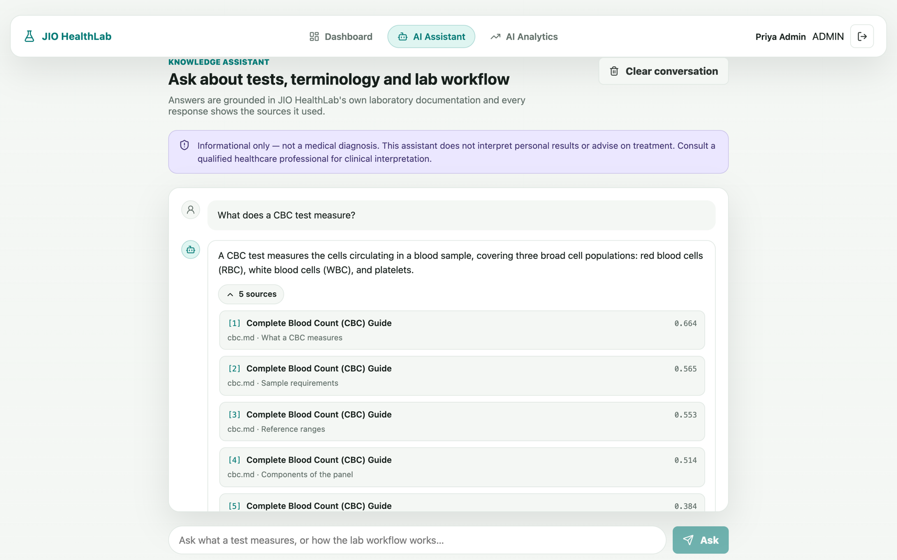
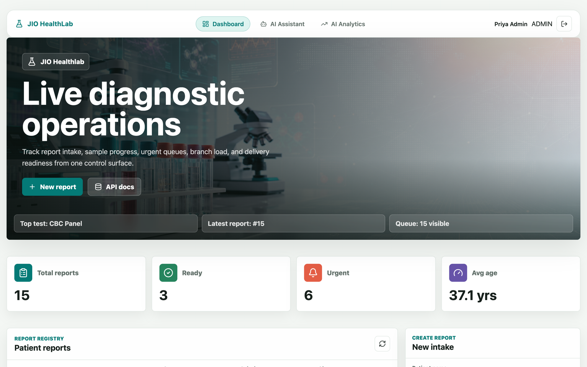
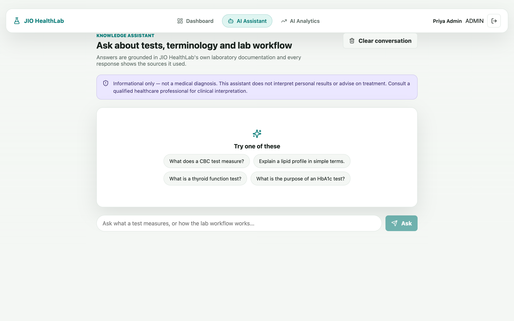
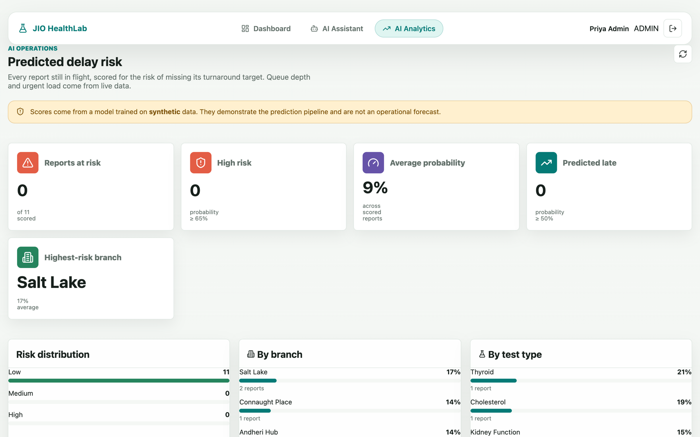
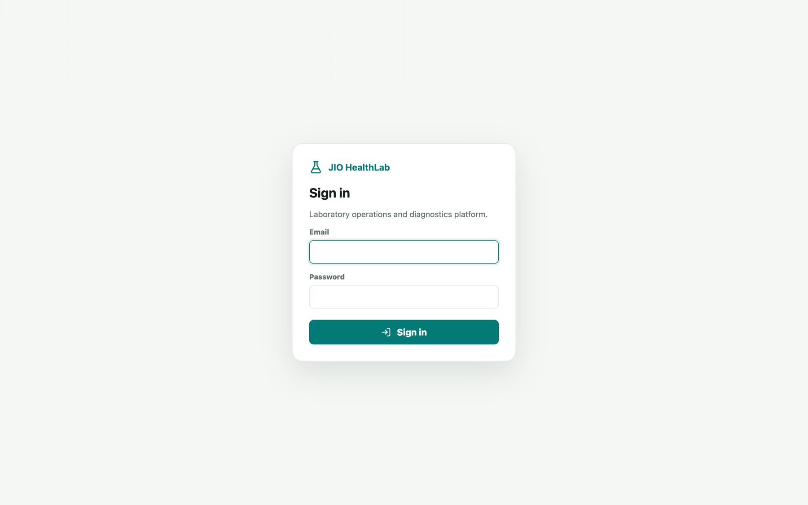
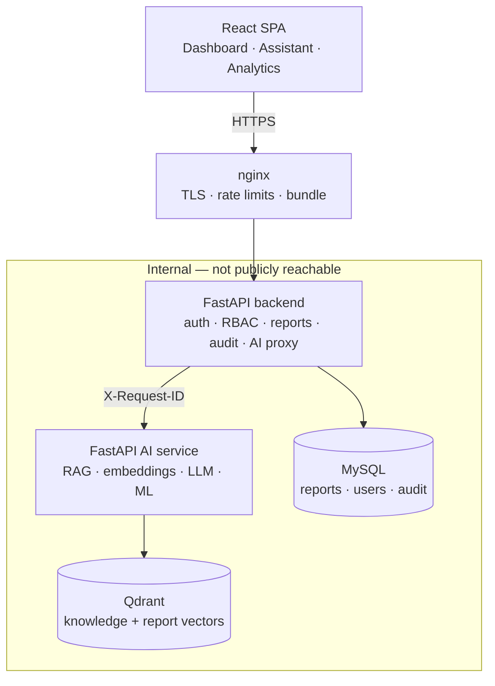

# 🏥 JIO HealthLab AI


An AI-powered laboratory operations platform: report management, a
retrieval-augmented knowledge assistant grounded in the lab's own
documentation, and a predictive model for turnaround delay.

```bash
git clone https://github.com/mohit6603/jio-healthlab.git
cd jio-healthlab
cp .env.example .env
docker compose up --build
```

That is the whole setup. The stack ingests the knowledge base and trains the
delay model on first start; nothing else is required.

> **Demo project on synthetic data.** No real patient information. The AI is
> informational only — not a medical diagnosis, and no regulatory claim
> (HIPAA, FDA, clinical validation) is made or implied.



*A real answer from the running system: grounded in the lab's own documentation,
streamed token by token, with every source and its similarity score.*

---

## Contents

[Features](#features) · [Screenshots](#screenshots) · [Architecture](#architecture) ·
[Stack](#technology-stack) · [Quick start](#quick-start) ·
[Environment](#environment-variables) · [Auth](#authentication) ·
[RAG](#rag-architecture) · [ML](#ml-delay-prediction) ·
[Evaluation](#evaluation) · [Testing](#testing) · [API](#api-documentation) ·
[Security](#security) · [Safety](#healthcare-safety-boundary) ·
[Deployment](#aws-deployment) · [CI/CD](#cicd) ·
[Monitoring](#monitoring) · [Troubleshooting](#troubleshooting) ·
[Future work](#future-improvements)

---

## Features

**Laboratory operations**
Report lifecycle, filtering and search, status management, dashboard metrics,
branch and city breakdowns.

**Knowledge assistant**
Grounded answers over the lab's own SOPs, test guides and FAQs, **streamed
token by token**, with the sources every answer used shown before the first
word arrives. Refuses honestly when the knowledge base has no answer.

**Report explanation**
Explains what a report's test measures — behind a PII boundary that sends no
patient identifier to the AI service.

**Semantic report search**
*"urgent kidney tests waiting in Mumbai"* returns the right reports, ranked.

**Delay prediction**
Probability a report misses its turnaround target, with banded risk and an
operations dashboard.

**Platform**
JWT auth with refresh rotation, four-role RBAC, append-only audit trail,
Prometheus metrics, structured JSON logs with cross-service request tracing.

---

## Screenshots

All captured from the running application, not mocked.
Regenerate with `cd frontend && npm run screenshots`.

### Operations dashboard


### AI assistant


Answers stream as they are written. Grounding appears in **0.07 s**, the first
token at 7.8 s, the full answer by 14 s — so almost none of the wait is silent.

### Predicted delay risk


Every in-flight report scored for the risk of missing its turnaround target.
Queue depth and urgent load come from live data; the model's learned branch
effect shows through — the worst branches are the least-resourced ones.

### Sign in


Sessions are httpOnly cookies. Signed in, `localStorage`, `sessionStorage` and
`document.cookie` are all empty.

---

## Architecture



The browser never reaches the AI service. Torch and transformers never enter
the backend image. An AI outage cannot take down the reports product — that is
structural, not aspirational: `api` has no `depends_on` for `ai-service`.

Full reasoning in [docs/architecture.md](docs/architecture.md).

---

## Technology stack

| Layer | Choice |
|---|---|
| Frontend | React 18, TypeScript, Vite 6, React Router 7, Vitest |
| Backend | FastAPI, Pydantic v2, SQLAlchemy 2, Alembic, PyJWT, argon2-cffi |
| AI service | FastAPI, Sentence Transformers, Transformers, PyTorch (CPU) |
| Vector DB | Qdrant 1.19 |
| ML | scikit-learn, pandas, NumPy, joblib |
| Database | MySQL 8.4 (PostgreSQL-compatible) |
| Infra | Docker Compose, nginx, GitHub Actions |

---

## Repository structure

```text
jio-healthlab/
├── backend/                 FastAPI: reports, auth, RBAC, audit, AI proxy
│   ├── app/
│   │   ├── routers/         ai · audit · auth · dashboard · metrics · reports
│   │   ├── services/        report · ai_client · auth · audit · sanitizer · risk
│   │   ├── security/        jwt · passwords · permissions
│   │   ├── models/ schemas/ dependencies/ core/
│   │   └── seed.py
│   ├── alembic/versions/    3 migrations
│   └── tests/               325 tests
│
├── ai-service/              FastAPI: RAG, embeddings, LLM, ML
│   ├── app/
│   │   ├── api/             health · documents · rag · ml · report_search
│   │   ├── rag/             loaders · chunker · embeddings · vector_store
│   │   │                    retriever · prompts · pipeline · safety · ingest
│   │   ├── llm/             provider · local_transformer · factory
│   │   ├── ml/              dataset · features · train · evaluate
│   │   │                    registry · predictor
│   │   └── bootstrap.py
│   ├── knowledge/           14 original documents: lab_tests · sop · faq
│   ├── evaluation/          43-question set + two evaluators
│   └── tests/               491 tests
│
├── frontend/                React SPA
│   └── src/{pages,auth,api.ts,types.ts}      75 tests
│
├── deploy/nginx/            production reverse proxy
├── docs/                    architecture · rag · ml · security · deployment
├── .github/workflows/       ci.yml · deploy.yml
├── docker-compose.yml       development
└── docker-compose.prod.yml  production overlay
```

---

## Quick start

**Prerequisites** — Docker with Compose v2, ~6 GB free disk, 4 GB RAM.

```bash
cp .env.example .env
docker compose up --build
```

| | |
|---|---|
| Application | <http://localhost> |
| Backend API docs | <http://localhost:8000/docs> |
| AI service docs | <http://localhost:8001/docs> |
| Qdrant dashboard | <http://localhost:6333/dashboard> |

### Demo accounts

Created by the seeder. Password for all four: `ChangeMe!Admin123`.

| Email | Role | Can |
|---|---|---|
| `admin@jiohealthlab.example.com` | ADMIN | Everything |
| `tech@jiohealthlab.example.com` | LAB_TECH | Update reports, risk analytics |
| `doctor@jiohealthlab.example.com` | DOCTOR | Read reports, explanations |
| `viewer@jiohealthlab.example.com` | VIEWER | Read-only, informational AI |

### First start

The `bootstrap` container ingests the knowledge base, trains the delay model
and **pre-downloads ~1.1 GB of model weights** into a Docker volume. Expect
3–6 minutes on a first run, most of it the download.

Pre-downloading is deliberate. Without it the stack looks ready, and then the
first person to ask the assistant a question waits minutes behind a gigabyte
download — usually long enough to hit a proxy timeout. The wait happens in
bootstrap, where waiting is expected.

The app is usable throughout: reports, dashboard and search work immediately;
only answer generation returns 503 until the weights land. Subsequent starts
reuse everything and take seconds.

### Commands

```bash
docker compose up --build              # start everything
docker compose down                    # stop, keep data
docker compose down -v                 # stop and delete all data and models
docker compose logs -f api             # backend logs
docker compose logs -f ai-service      # AI service logs

docker compose exec ai-service python -m app.rag.ingest       # re-ingest
docker compose exec ai-service python -m app.ml.train         # retrain
docker compose exec ai-service python -m app.bootstrap        # both, if missing
docker compose exec ai-service python -m evaluation.evaluate_retrieval
docker compose exec ai-service python -m evaluation.evaluate_rag
docker compose exec api alembic upgrade head                  # migrations
```

### Without Docker

```bash
# Backend
cd backend && pip install -r requirements-dev.txt
alembic upgrade head && python -m app.seed
uvicorn app.main:app --reload

# AI service (LLM_PROVIDER=none avoids a 1 GB download)
cd ai-service && pip install -r requirements-lite.txt
LLM_PROVIDER=none uvicorn app.main:app --port 8001

# Frontend
cd frontend && npm install && npm run dev
```

---

## Environment variables

Every knob is in [`.env.example`](.env.example) with comments. The ones that
matter:

| Variable | Default | Notes |
|---|---|---|
| `JWT_SECRET_KEY` | dev placeholder | **The app refuses to start in production while this is unchanged** |
| `LLM_PROVIDER` | `local` | `none` disables generation; retrieval keeps working |
| `LLM_MODEL` | `Qwen/Qwen2.5-0.5B-Instruct` | Must be instruction-tuned |
| `EMBEDDING_MODEL` | `all-MiniLM-L6-v2` | 384-d, 256 word-piece window |
| `CHUNK_SIZE` | `220` | Deliberately below the embedding window |
| `TOP_K` / `SCORE_THRESHOLD` | `5` / `0.25` | Retrieval tuning |
| `DATABASE_URL` | local MySQL | `postgres://` is rewritten automatically |

---

## Database migrations

Alembic, for every schema change. Three migrations: initial schema, users and
refresh tokens, audit and AI query logs.

```bash
docker compose exec api alembic upgrade head
docker compose exec api alembic check          # fails if models drifted
docker compose exec api alembic revision --autogenerate -m "description"
```

CI applies, checks and rolls back the whole chain on every push.

---

## Authentication

15-minute access JWT plus a revocable refresh token, rotated on every use.
Only a SHA-256 digest of the refresh token is stored, and the token itself
lives in an httpOnly, SameSite=Strict cookie that JavaScript cannot read.
Eight consecutive failures lock an account for 15 minutes.

```
POST /api/auth/login     credentials → access + refresh token
POST /api/auth/refresh   rotate; reusing a revoked token ends ALL sessions
GET  /api/auth/me        user + the permissions their role grants
POST /api/auth/logout    revoke one session or all
```

Four roles — `VIEWER`, `LAB_TECH`, `DOCTOR`, `ADMIN`. Routes declare a
*permission*; the role that holds it is decided in one place. See
[docs/security.md](docs/security.md).

---

## RAG architecture

```
question → clinical check → embed → Qdrant → prompt → generate → screen → answer + sources
```

Three behaviours are enforced in code, not asked of the model:

1. **No context, no answer** — nothing above threshold means a fixed refusal
   and the model is never called.
2. **Citations mirror retrieval** — never parsed out of the answer text.
3. **The clinical boundary is code** — see [safety](#healthcare-safety-boundary).

**Chunking** is section-aware at 220 tokens, deliberately below MiniLM's
verified 256 word-piece window — at 500 the tail of every large chunk would be
truncated before embedding while still being shown as context.

Details and the model comparison in [docs/rag.md](docs/rag.md).

### Document ingestion

`.md`, `.txt`, `.pdf`. Drop files into `ai-service/knowledge/<category>/` and
re-ingest, or `POST /documents/ingest` as an administrator. Deterministic chunk
IDs mean re-ingesting replaces rather than duplicates.

---

## ML delay prediction

Predicts whether a report will miss its turnaround target.

**The training data is synthetic** — there is no historical dataset, so
`app/ml/dataset.py` generates one from a documented causal story. Every metric
measures how well a model recovers *that generator*.

```bash
docker compose exec ai-service python -m app.ml.train
```

Compares logistic regression, random forest and gradient boosting on a
validation split; reported metrics come from a test split selection never saw.

| | |
|---|---|
| Selected | logistic_regression (val ROC-AUC 0.8561) |
| Test ROC-AUC | **0.8639** |
| Accuracy / Precision / Recall / F1 | 0.7762 / 0.6193 / 0.8018 / 0.6988 |
| **Shuffled-label control** | **0.4843** — chance, so nothing leaks |

Risk bands: `low < 0.35 ≤ medium < 0.65 ≤ high`. Every prediction carries its
`model_version`. Details in [docs/ml.md](docs/ml.md).

---

## Evaluation

43 hand-written questions across the knowledge base. Expectations were
written by reading the documents; a test asserts every expected keyword
actually appears in its cited source.

**Retrieval** — Hit@1 **0.857**, Hit@5 **1.000**, MRR **0.917**, correct
rejections **1.000**, latency **5.99 ms** mean.

**End to end** — source presence 0.971, keyword coverage 0.771, refusal
accuracy **1.000**, boundary accuracy **1.000**, system prompt leaks **0**.

Keyword coverage of 0.77 is honest, not polished: some misses are wording, and
some are the 0.5B model genuinely getting it wrong while retrieval ranked the
right chunk first. Both are documented in [docs/rag.md](docs/rag.md).

---

## Testing

```bash
cd backend    && pytest                    # 325
cd ai-service && pytest                    # 491 (+ 22 integration)
cd frontend   && npm test                  # 75
```

**891 tests.** Backend uses in-memory SQLite and mocks the AI service with
respx — no model, no Qdrant, no network. AI-service unit tests run *without*
torch installed, which keeps CI fast and proves the graceful-degradation paths.
Integration tests against a real Qdrant are marked and run separately.

---

## API documentation

OpenAPI at `/docs` (backend) and `:8001/docs` (AI service), grouped as
Authentication, Reports, Dashboard, AI, Audit, System — and on the AI service
RAG, Documents, ML, Report search.

Every error uses one envelope:

```json
{ "error": { "code": "AI_SERVICE_UNAVAILABLE", "message": "..." } }
```

Codes are stable and meaningful — the UI distinguishes `GENERATION_DISABLED`
from `MODEL_UNAVAILABLE` from `VECTOR_STORE_UNAVAILABLE`.

---

## Security

Argon2id passwords · **httpOnly SameSite=Strict cookie sessions** · refresh
rotation with reuse detection · **account lockout** · no account enumeration ·
permission-based RBAC · PII allow-list · log redaction · append-only audit ·
strict CSP · nginx rate limiting · unprivileged containers · production secret
guard.

Sessions are held where JavaScript cannot reach them. Verified in a browser
while signed in: `localStorage`, `sessionStorage` and `document.cookie` are all
empty, and a reload still restores the session.

[docs/security.md](docs/security.md) documents all of it — **including a
"Known gaps" table** naming what is not protected.

---

## Healthcare safety boundary

The assistant explains what tests measure and what terminology means. It does
**not** diagnose, interpret an individual's results, or advise on treatment.

This is enforced in code because the prompt was not enough. With a system
prompt saying "do not diagnose", the model still replied *"your haemoglobin
level of 9 mg/dL indicates mild anemia"* and recommended supplements and
transfusions — none of it in the retrieved context. So clinical requests are
now detected **before** retrieval and never reach the model, and generated
answers are re-screened.

These are heuristics. They reduce risk; they do not make this safe for clinical
use. **No HIPAA, FDA or clinical-validation claim is made.**

---

## AWS deployment

Single EC2 host running the compose stack behind host nginx, with RDS and
Qdrant Cloud managed, and a documented path to ECS.

**`t2.micro` will not work** — 1 GB RAM, and the AI service alone needs ~1.5 GB.
`t3.medium` is the realistic minimum (~$48/month all-in), or `t3.small` with
`LLM_PROVIDER=none` (~$33).

Step-by-step in [docs/deployment.md](docs/deployment.md).

---

## CI/CD

`.github/workflows/ci.yml` on every push and PR: lint, type check and test all
three services; apply, drift-check and roll back migrations; Qdrant integration
tests against a real service container; build all three images.

CI never downloads model weights — the AI service installs
`requirements-lite.txt`, which also exercises the degradation paths.

`.github/workflows/deploy.yml` builds and pushes to ECR and rolls out via SSM.
**OIDC, no long-lived AWS keys.** Required secrets and variables are listed in
[docs/deployment.md](docs/deployment.md).

---

## Monitoring

Structured JSON logs from both services, with `X-Request-ID` propagated so one
user action is traceable across both streams.

`GET /metrics` on the **API** (`:8000`, not through the public web tier)
exposes Prometheus text — report counts by status and priority, AI usage and failures by type,
mean AI latency, ungrounded-answer counts, audit events by action and outcome.

Health endpoints separate liveness from readiness: `/health` never touches a
dependency, so a Qdrant outage cannot make an orchestrator restart a working
process. `/health/ready` probes dependencies and reports what is degraded.

---

## Troubleshooting

**`ML_MODEL_NOT_TRAINED`** — no artifact yet.
`docker compose exec ai-service python -m app.ml.train`

**`GENERATION_DISABLED`** — `LLM_PROVIDER=none`. Intentional on constrained
machines; retrieval and search still work.

**AI assistant slow (10–30 s)** — expected. CPU generation runs at ~4 tok/s.
Use `LLM_PROVIDER=none` for retrieval-only, or deploy with a GPU.

**First start slow** — downloading ~1.1 GB of weights.
`docker compose logs -f ai-service`

**`VECTOR_STORE_UNAVAILABLE`** — Qdrant not ready.
`docker compose ps qdrant` and `curl localhost:6333/readyz`

**Empty assistant answers** — knowledge not ingested.
`docker compose exec ai-service python -m app.rag.ingest --stats`

**Refuses to start in production** — `JWT_SECRET_KEY` is still the placeholder.
That guard is deliberate.

**Out of memory** — the AI service needs ~1.5 GB. Raise Docker's memory limit
or set `LLM_PROVIDER=none`.

---

## Future improvements

- MFA for administrators
- A reranker over the top-k, and hybrid keyword + vector retrieval
- Train the delay model on real turnaround data once it exists
- Per-user AI quotas
- MLflow, once there is more than one model

---

## License

MIT — see [LICENSE](LICENSE).
