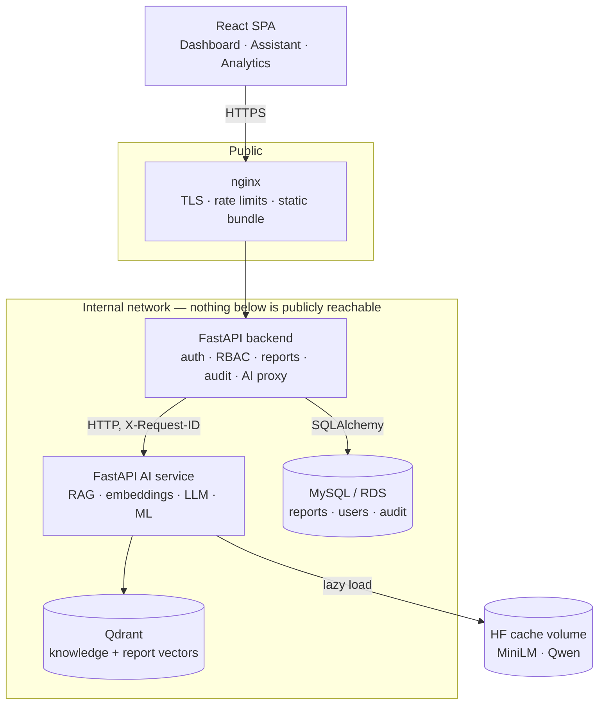

# Architecture

Why the system is shaped this way, and what each boundary is protecting.

---

## The shape



The browser never talks to the AI service. Every AI call is proxied by the
backend, which is where authentication, authorisation, rate limiting and the
PII boundary already live.

---

## Why a separate AI service

The obvious alternative is one FastAPI app. Three reasons it is not:

**Dependency weight.** torch, transformers, sentence-transformers and
scikit-learn make a 2 GB image. The backend image is 392 MB and deploys in
seconds. Merging them would mean every schema change ships two gigabytes.

**Failure isolation.** A model that will not load, a Qdrant outage, an OOM
during generation — none of these should stop a technician updating a report
status. The split makes that structural rather than aspirational: the backend
does not import a single AI dependency, and `docker-compose.yml` deliberately
gives `api` no `depends_on` for `ai-service`.

**Different scaling shapes.** The backend is I/O bound and cheap to replicate.
Generation is CPU or GPU bound and expensive. They want different instance
types and different replica counts.

The cost is a network hop and a serialisation boundary. `X-Request-ID` is
propagated across it so one user action is traceable in both log streams.

---

## Why Qdrant

Requirements were: metadata filtering alongside vector search, persistence,
a first-class Python client, and something runnable in a container locally and
as a managed service in production.

- **pgvector** would avoid a new service, but the lab database and the vector
  index have different backup, scaling and access-control needs, and mixing
  patient records with an embedding index in one database is a boundary worth
  keeping.
- **FAISS** is a library, not a service: no persistence story, no filtering,
  no separate scaling.
- **Qdrant** gives payload filtering, named collections, a REST and gRPC API,
  and Qdrant Cloud for production.

Two collections, never shared:

| Collection | Holds | Why separate |
|---|---|---|
| `healthlab_knowledge` | Curated lab documentation | Citable verbatim in answers |
| `healthlab_reports` | Sanitised report metadata | Operational; must never appear as a citation |

Separation is enforced three ways: different collections, an unconditional
`category="report"` filter on every report search, and separate routers.

---

## Why Sentence Transformers

`all-MiniLM-L6-v2` runs on CPU in milliseconds, produces 384-dimension
vectors, and is small enough to download in seconds. Retrieval measures
Hit@5 = 1.0 and MRR = 0.917 on the evaluation set, which is more than adequate
for a corpus this size.

Its `max_seq_length` is **256 word pieces**, verified against the loaded model.
That number drives `CHUNK_SIZE=220`: at the 500 the brief suggested, every
large chunk would be truncated before its vector was computed while still
being returned whole as context, so retrieval would silently ignore half of it.

Embedding is behind an `Embedder` protocol. Swapping the model means changing
`EMBEDDING_MODEL`, `EMBEDDING_DIMENSION` and re-indexing — no retrieval code
changes.

---

## The model-provider abstraction

`llm/provider.py` defines `LLMProvider`. `llm/factory.py` maps `LLM_PROVIDER`
onto an implementation. RAG depends only on the interface.

```
LLM_PROVIDER=local    Hugging Face Transformers, in process
LLM_PROVIDER=none     generation disabled; retrieval unaffected
                      (OpenAI, Bedrock: add a subclass and a registry entry)
```

`none` is not a placeholder — it is the supported way to run on a constrained
machine or in CI. Everything except answer generation keeps working.

---

## Failure boundaries

| Failure | Effect | Verified |
|---|---|---|
| AI service down | `/api/ai/*` → 503; reports, dashboard, auth unaffected | Stopped the container mid-run |
| Generation model unavailable | `/rag/query` → 503; `/rag/search` still 200 | `LLM_PROVIDER=none` |
| Qdrant down | Retrieval → 503; reports unaffected; `/health` still 200 | Readiness split from liveness |
| No trained ML model | `/ml/*` → 503 naming the fix; RAG unaffected | Fresh container |
| Audit write fails | Logged; the user's action still succeeds | Test with a failing commit |

The pattern throughout: **an optional subsystem degrades, it does not cascade.**

---

## PII handling

The AI service never receives a patient identifier. The boundary is an
allow-list in `backend/app/services/sanitizer.py`: a field is excluded unless
explicitly judged safe, so adding a column to `Report` cannot silently start
leaking it.

```
crosses      test_type, status, priority, city, branch, age band, due status
never leaves patient_name, phone, email, doctor_name, notes,
             exact age, gender, report id, exact timestamps
```

Age is coarsened to ten-year bands. Timestamps become "overdue" or "on
schedule". Notes are dropped whole rather than scrubbed — they are free text
staff write, and no pattern match should be trusted with that.

Report explanations return `context_sent`, the exact payload that crossed, so
the boundary is auditable from the response rather than only from code review.

---

## ML assumptions

The delay model is trained on **synthetic data**. There is no historical
turnaround dataset, so `ml/dataset.py` generates one from a documented causal
story. Every metric measures how well a model recovers *that generator* — not
real-world accuracy. This is stated in the module, in the CLI banner, in every
model's metadata, and in every prediction response (`synthetic_model: true`).

The generator is deliberately non-trivial: the label comes from a latent
processing time that is then discarded, and multiplicative lognormal noise puts
an irreducible error floor in the data. Retraining on shuffled labels gives
ROC-AUC 0.484 — chance — against 0.864 on real labels, which is the evidence
that no feature leaks the outcome.

Model selection happens on a validation split; reported metrics come from a
test split selection never saw.

---

## Deployment

See [deployment.md](deployment.md). In short: one EC2 host running the compose
stack behind host nginx, with RDS and Qdrant Cloud as managed services, and a
documented path to ECS when a single host stops being enough.
