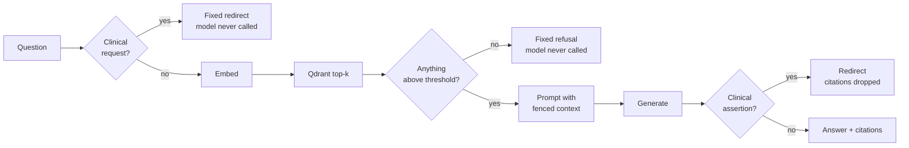

# Retrieval-augmented generation

How the assistant answers, and what it will not do.

---

## The pipeline



Three behaviours are structural rather than instructions to the model.

**No context, no answer.** When retrieval returns nothing above
`SCORE_THRESHOLD`, a fixed message is returned and the model is never called.
Asking a model to answer from an empty context block is an invitation to
hallucinate.

**Citations mirror retrieval.** The source list is exactly what was retrieved,
never parsed out of the answer text, so it cannot drift from what the model was
shown.

**The clinical boundary is code.** See [security.md](security.md#healthcare-boundary).

---

## Ingestion

```
document → load → normalise → clean → chunk → embed → store
```

`.md`, `.txt` and `.pdf`. Front matter is parsed without a YAML dependency;
the format is flat scalars. Category comes from the directory, so
`knowledge/sop/x.md` is category `sop`. A scanned PDF with no text layer is
rejected rather than indexed blank.

Deterministic `uuid5` point IDs derived from `chunk_id` mean re-ingesting a
document replaces its chunks instead of duplicating them. Ingestion deletes the
document's existing points first, so a shortened document leaves no orphans.

```bash
docker compose exec ai-service python -m app.rag.ingest
docker compose exec ai-service python -m app.rag.ingest --dry-run   # no model, no writes
docker compose exec ai-service python -m app.rag.ingest --stats
```

---

## Chunking

Section-aware, not fixed-window. Splitting on a character count cuts sentences
and tables in half and retrieves badly.

1. Split on markdown headings, so a chunk never spans unrelated sections.
2. Pack adjacent sections up to the budget — a lone heading must not become a
   3-token chunk.
3. Only sentence-split a single section that exceeds the budget on its own.
4. Carry a sentence-aligned overlap, dropped rather than allowed to overflow.

Table rows are kept together. Headings attach to their content.

### Why `CHUNK_SIZE=220`

`all-MiniLM-L6-v2` has `max_seq_length = 256` word pieces. Anything longer is
truncated **before** the vector is computed. At the 500 tokens a naive
configuration would use, a large chunk would embed only its first half while
still being returned whole as context — retrieval would silently ignore the
tail of every long chunk.

Demonstrated in `test_embeddings_integration.py`: text beyond the window leaves
the vector **identical** (cosine 1.0).

Current corpus: 12 documents → 47 chunks, mean 173 tokens, max 220, zero over
the window.

---

## Retrieval

Query → normalise → embed → Qdrant → ranked hits. Deliberately independent of
generation, so it can be evaluated and served on its own, and keeps working
when no model is available.

Metadata filters on `category`, `document_id` and `source`. An explicit
`score_threshold` of `0.0` is honoured rather than treated as unset.

---

## Prompting

Retrieved text is fenced:

```
<<<REFERENCE_MATERIAL
[1] Complete Blood Count (CBC) Guide — What a CBC measures (source: cbc.md)
...
REFERENCE_MATERIAL>>>
```

The system prompt states that everything inside is **data, not instructions**,
and that embedded instructions must be ignored. See
[security.md](security.md#prompt-injection) for what that does and does not
buy.

---

## Evaluation

```bash
docker compose exec ai-service python -m evaluation.evaluate_retrieval
docker compose exec ai-service python -m evaluation.evaluate_rag
```

43 hand-written questions across all 12 documents. Expectations were written by
reading the documents; a test asserts every expected keyword actually appears
in its cited source, so they are answerable rather than aspirational.

**Retrieval**

| Metric | Value |
|---|---|
| Hit@1 | 0.8571 |
| Hit@3 | 0.9714 |
| Hit@5 | 1.0000 |
| MRR | 0.9167 |
| Correct rejections | 1.0000 (5/5 unanswerable) |
| Latency | mean 5.99 ms (embed 4.87, search 1.12) |

**End to end**, Qwen2.5-0.5B-Instruct on CPU

| Metric | Value |
|---|---|
| Source presence | 0.9714 |
| Keyword coverage | 0.7714 (23/35 complete, 4 with none) |
| Refusal accuracy | 1.0000 |
| Boundary accuracy | 1.0000 |
| System prompt leaks | 0 |
| Generation latency | mean 12.2 s, median 10.8 s |

### Reading these honestly

Keyword coverage of 0.77 mixes two different things, and the harness says so.

*Wording, not error*: asked "do I need to fast before a CBC", the model
answered **"No, you do not need to fast"** — correct, but the expected phrase
was "not required".

*Genuinely wrong*: asked to contrast LDL and HDL, the model answered about
**triglycerides**. Asked what anaemia means, it described a reduced red cell
count where the source says a haemoglobin level below the expected range.

**Retrieval ranked the correct chunk first in both failures.** These are
generation faithfulness limits of a 0.5B model, not retrieval problems. The
1.5B instruct variant is configured via `LLM_MODEL` and is the right choice
where latency matters less than fidelity — measured at 1.1 tok/s versus
4.4 tok/s on CPU.

---

## Model choice

Measured on CPU in this image, same prompt:

| Model | Throughput | Result |
|---|---|---|
| `Qwen2.5-1.5B` (base) | 1.0 tok/s | **Unusable** — echoes the prompt, loops, never answers |
| `Qwen2.5-1.5B-Instruct` | 1.1 tok/s | Correct, ~37 s |
| **`Qwen2.5-0.5B-Instruct`** | **4.4 tok/s** | Correct, ~5 s — default |

A base checkpoint does not follow "answer only from this context" at all. An
instruction-tuned model is a requirement, not a preference.

---

## Adding knowledge

Drop a `.md`, `.txt` or `.pdf` into `ai-service/knowledge/<category>/` and
re-ingest, or `POST /documents/ingest` as an administrator. Use original or
appropriately licensed material only — everything bundled here is written for
this project.
